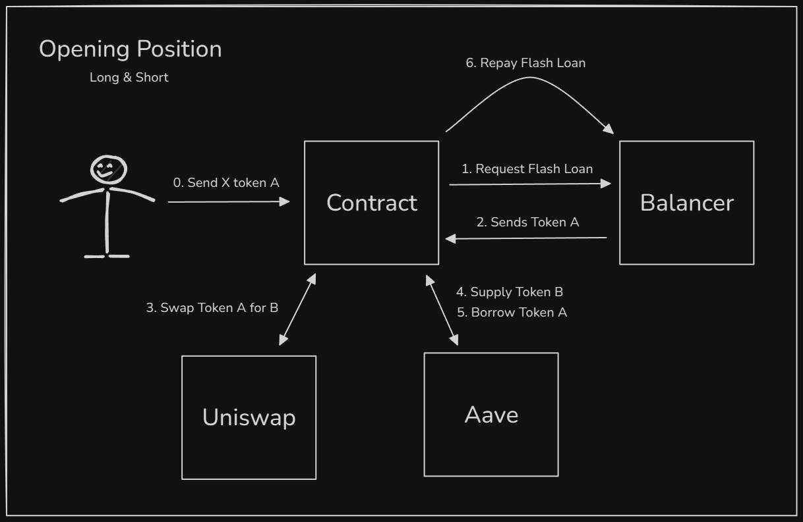
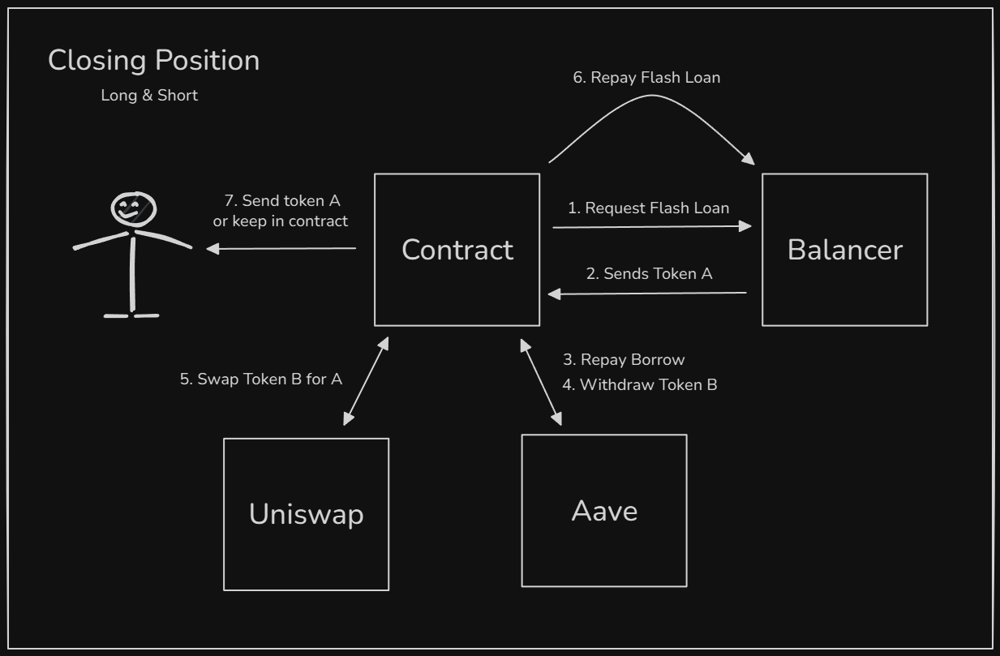

# Flash Loan Leverage Demo

Make use of a Flash loan from Balancer to perform shorts or longs with leverage. 

## Technology Stack & Tools

- [Solidity](https://docs.soliditylang.org/en/v0.8.18/) (Writing Smart Contracts)
- Javascript (Testing)
- [Hardhat](https://hardhat.org/) (Development Framework)
- [Ethers.js](https://docs.ethers.org/v6/) (Blockchain Interaction)
- [Alchemy](https://www.alchemy.com/) (Blockchain Connection)
- [Balancer V2](https://docs-v2.balancer.fi/reference/contracts/flash-loans.html) (Flash Loan Provider)
- [Aave V3](https://aave.com/docs) (Supplying & Borrowing Tokens)
- [Uniswap V3](https://docs.uniswap.org/contracts/v3/overview) (Swapping Tokens)

## Requirements For Initial Setup
- Install [NodeJS](https://nodejs.org/en/). We recommend using the latest LTS (Long-Term-Support) version, and preferably installing NodeJS via [NVM](https://github.com/nvm-sh/nvm#intro).
- Create an [Alchemy](https://www.alchemy.com/) account, you'll need to create an app for the Ethereum chain.

## Setting Up
### 1. Clone/Download the Repository
Make sure to enter the project directory before attempting to run the project related commands:
```bash
cd flashloan-masterclass-leverage
```

If the directory doesn't exist, you can execute `pwd` to find out your current path, and `ls` to see the files and folders available to you.

### 2. Install Dependencies:
```bash
npm install
```

### 3. Add RPC URL to Hardhat Keystore
You should have an Ethereum RPC URL from Alchemy. You'll add it to the keystore.

```bash
npx hardhat keystore set ALCHEMY_DEVELOPER_RPC_URL --dev
```

You can verify your keystore variables by executing `npx hardhat keystore get ALCHEMY_DEVELOPER_RPC_URL --dev` or `npx hardhat keystore list --dev`. You can see full documentation on Hardhat's keystore [here](https://hardhat.org/docs/learn-more/configuration-variables).

### 4. Run Tests:
`npx hardhat test --network hardhatMainnet`

## Contract Addresses Used

Here are the main contract addresses used and you can see them in the block explorer. Note that these addresses are only for the Ethereum network and addresses for contracts can be different for different networks. Always verify contract addresses you plan to interact with through official documentation and the block explorer!

- [WETH](https://etherscan.io/token/0xc02aaa39b223fe8d0a0e5c4f27ead9083c756cc2)
- [USDC](https://etherscan.io/token/0xA0b86991c6218b36c1d19D4a2e9Eb0cE3606eB48)
- [aWETH](https://etherscan.io/address/0x4d5F47FA6A74757f35C14fD3a6Ef8E3C9BC514E8)
- [aUSDC](https://etherscan.io/address/0x98C23E9d8f34FEFb1B7BD6a91B7FF122F4e16F5c)
- [Aave Pool Address](https://etherscan.io/address/0x87870Bca3F3fD6335C3F4ce8392D69350B4fA4E2)
- [Uniswap V3 Router](https://etherscan.io/address/0xE592427A0AEce92De3Edee1F18E0157C05861564)
- [Uniswap V3 USDC/WETH Pool](https://etherscan.io/address/0x88e6A0c2dDD26FEEb64F039a2c41296FcB3f5640)
- [Balancer Vault](https://etherscan.io/address/0xBA12222222228d8Ba445958a75a0704d566BF2C8)

## Overview of Balancer

It helps to reference Balancer's documentation on how their Flash Loans work:

- [Balancer](https://docs-v2.balancer.fi/reference/contracts/flash-loans.html)

The high level idea is that your smart contract calls on Balancer's Vault contract, specifically their function *flashLoan()*. On their end, they send your smart contract the tokens, and call *receiveFlashLoan()* on your contract.

Your *receiveFlashLoan()* function is basically where you'll use the funds for anything you want. However, once *receiveFlashLoan()* has finished executing, Balancer will check to ensure you've sent their tokens back. If you haven't, Balancer will revert your transaction.

### Balancer's Error Codes

Should you be using Balancer flash loans for your projects, you may come across errors in your testing that relate to Balancer. If you do, the best place to check out is:

- [https://docs-v2.balancer.fi/reference/contracts/error-codes.html](https://docs-v2.balancer.fi/reference/contracts/error-codes.html)

Some common errors you may see:

- **BAL#515**. This means you haven't paid back the flash loan in your transaction.
- **BAL#528**. This means Balancer doesn't have the amount of tokens you are trying to flash loan.

## Architecture of Position.sol

### The Main Entrypoints

There are 2 main entrypoints for interacting with Position.sol:
- *openPosition()*
- *closePosition()*

#### Open Position

From a high level, in *openPosition()*:
1. You get X amount of token A from the flash loan.
2. You swap X + Y amount for Z amount of token B
3. You supply the Z amount of token B into Aave.
4. You borrow X flash amount of token A from Aave.
5. You repay back X amount of token A back to the flash loan.

Below you can see a diagram explaining the transaction. Keep in mind step 0 is a separate transaction and *openPosition()* starts on step 1:



#### Close Position

Inside of *closePosition()*:
1. You get X amount of token A from flash loan.
2. You repay Aave the X amount of token A you borrowed + interest.
3. You withdraw Y amount of token B you supplied to Moonwell.
4. You swap Y amount of token B for Z amount of token A.
5. You repay back X amount of token A back to the flash loan.
6. Keep remaining profit.

Below you can see a diagram explaining the transaction:



To get an idea of the overall function flow, in *openPosition()*:

1. *openPosition()*
2. *receiveFlashLoan()*
3. *open()*
4. *swap()*
5. *supply()*
6. *borrow()*

*closePosition()* follow a similar flow:

1. *closePosition()*
2. *receiveFlashLoan()*
3. *close()*
4. *repay()*
5. *withdraw()*
6. *swap()*

When looking into the internal functions, be sure to reference the documentation for Aave or Uniswap.

- [https://aave.com/docs](https://aave.com/docs)
- [https://docs.uniswap.org/contracts/v3/overview](https://docs.uniswap.org/contracts/v3/overview)

## Advanced Testing and Expanding

### Unit Tests

Inside of *test/fixtures/setup.ts* you can experiment with different amounts to test different scenarios. For example changing the **INITIAL_CAPITAL_AMOUNT** and **BORROW_AMOUNT** for either the *longFixture()* or *shortFixture()*:

```javascript
  const INITIAL_CAPITAL_AMOUNT = ethers.parseUnits("1000", 6);
  const BORROW_AMOUNT = ethers.parseUnits("2000", 6);
```

You can optionally build your own fixtures for specific scenarios and add on to the existing *test/Position.ts* tests.

### Building Scripts

For expanding the project further, and for extra practice, it helps to branch off the unit test and write scripts for interacting with the **Position** contract. Maybe consider building individual scripts for calling *openPosition()* and *closePosition()*, and try your hand at determining what other helper scripts you could build.

As an extra challenge, you could try changing the smart contract to use a different defi exchanges, markets, or different lending protocols. 

## Helpful Resources for Flash Loan Research

### Uses of Flash loans
* Arbitrage - Use the vast funds to make profits from price discrepencies e.g on Exchange.
  - [Example of our Trading Bot Masterclass](https://dappuniversity.teachable.com/courses/940808/lectures/24527435)
* Yield Farming - Increase exposure to earn more reward tokens on lending protocols.
  - [Example of our previous Flash Loan Masterclass](https://dappuniversity.teachable.com/courses/blockchain-mastery-university/lectures/18173760)
  
### Other Flashloan Providers
* [Aave Flashloan](https://docs.aave.com/developers/guides/flash-loans)
* [Kollateral](https://www.kollateral.co/) - A liquidity aggregator  
* [Uniswap V2 Flashswaps](https://docs.uniswap.org/protocol/V2/concepts/core-concepts/flash-swaps)
    - Example Uniswap FlashSwap can be [found here](https://github.com/Uniswap/uniswap-v2-periphery/blob/master/contracts/examples/ExampleFlashSwap.sol)